# Clyra AI Clipper V7 — Target Architecture

_Target architecture only. A dependency becomes active only after source and
model-weight licence review plus an availability/rollback test._

```mermaid
flowchart LR
  UI["Electron AIClipper UI"] --> API["server.ts API + SSE"]
  API --> Jobs["Clyra coordinator\none heavy worker at a time"]
  Jobs --> Master["Master source + PTS reader"]
  Master --> Light["Light pass\nVAD · scenes · faces · motion · OCR deltas"]
  Light --> Index["Timeline index and evidence cache"]
  Index --> Planner["LLM query planner\nnever chooses timestamps alone"]
  Planner --> Retrieve["OpenCLIP / InternVideo retrieval"]
  Retrieve --> Verify["Qwen3-VL temporal verifier\nbefore → event → after"]
  Verify --> EDL["Canonical EDL v1"]
  EDL --> Track["Speaker/subject tracks\n→ offline crop path"]
  Track --> Render["Master-source FFmpeg\nsubtitles + final QC"]
  Render --> UI
```



## Execution tiers

| Tier | Work | Guarantee |
| --- | --- | --- |
| Fast | Audit, transcript, light visual/audio signals, face scan and basic candidate retrieval. | Results disclose unavailable visual proof. |
| Balanced | Fast + embedding index and selected-range tracking. | Evidence-labelled candidates and selected-person attempt. |
| Deep | Balanced + temporal VLM on shortlisted windows only. | Exact visual result only after verification. |

No ML model loads in Electron. Worker stages stream frames through bounded
queues, release them after compact metadata extraction and keep only disk-backed
evidence. InternVideo, Qwen3-VL, segmentation and final rendering never overlap
on an 8 GB machine.

## Canonical EDL v1

Preview and export must read the same document:

```ts
interface ClipEdlV1 {
  schemaVersion: "clyra.clipper.edl.v1";
  source: { fingerprint: string; masterPath: string; durationMs: number };
  clips: Array<{
    id: string;
    sourceStartMs: number;
    sourceEndMs: number;
    evidence: EvidenceBundle;
    cropPath: CropPathKeyframe[];
    layout: LayoutDecision;
    captions: CaptionDecision[];
    audioEdits: AudioEdit[];
  }>;
}
```

Every frame evaluates `cropPath` and captions by media timestamp. Manual edits
patch only the relevant EDL range; neither React animation nor a separate
FFmpeg formula may become a second source of truth.

## Moment-finding protocol

```text
parse query -> constraints
  -> broad multimodal retrieval
  -> timestamped candidate-window inspection
  -> before/during/after verification
  -> boundary optimisation
  -> EDL + crop/subtitle decisions
  -> master render + quality checks
```

The language model is an orchestrator: it can parse a request and compare tool
evidence but cannot select a final timestamp without tools. `verifyTransition`
returns `exact`, `approximate`, `transcript-only` or `no-match` with separate
visual/audio/OCR/transcript evidence. For example, “leave the zoo” must verify
inside → departure → outside, or return no exact match.

## Tracking and cache contracts

Tracking is `PTS frames -> VIDEO-mode landmarks -> stable anchor -> persistent
identity -> per-shot trajectory -> comfort-zone composition -> offline optimiser
-> stored keyframes`. Active-speaker mode adds mouth motion, VAD and
transcript-speaker overlap before changing identity. Selected-person mode holds
the chosen identity through brief loss and must use wide/manual/reject fallback
rather than jumping to another face.

Cache source audit/proxy/PTS map, words/VAD, scenes/OCR/faces, embeddings,
query results, verification, crop path, captions and renders independently.
Changing captions cannot rerun visual analysis; changing one crop keyframe
cannot rerun retrieval or transcription.

## Security and licences

Use only public/authorised source access. Never implicitly read browser cookies
or social passwords. Provider secrets stay in backend services. Model source
and weights are independently licensed, pinned, attributed and feature-gated;
unavailable components produce a truthful fallback state.
